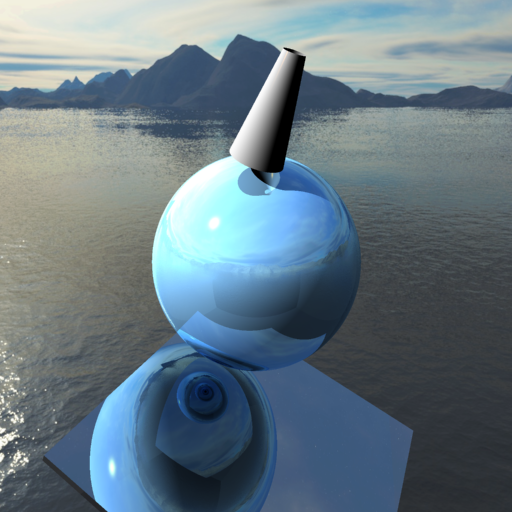

# Getting Started

## Build

Assume the present working directory (PWD) is under the root directory of this
project. The following commands will create a directory named as "build" and
build the starter code within this directory using cmake.

```
mkdir build
cd build
cmake .. && make -j8
```

When finished, the binary will be called ray and can be found in build/bin/

Simply type `bin/ray` to run

Note that you can change the build directory to any name you like,
"build" is simply the most commonly used

## Artifact



Above is an artifact produced by the ray tracer, exemplifying some of its features

## Dependencies

* FLTK
* OpenGL
For your own system you may need to install them through the package manager or user repo.
If you are using OSX, [Homebrew](http://brew.sh/) is recommended.

The default compiler used is g++-5.2.0 (located in /lusr/opt/gcc-5.2.0/bin/g++).
Otherwise the default C++11 compiler is used.

## Acknowledgement

This starter code is modified based on the ray tracing project of CS 384G.
